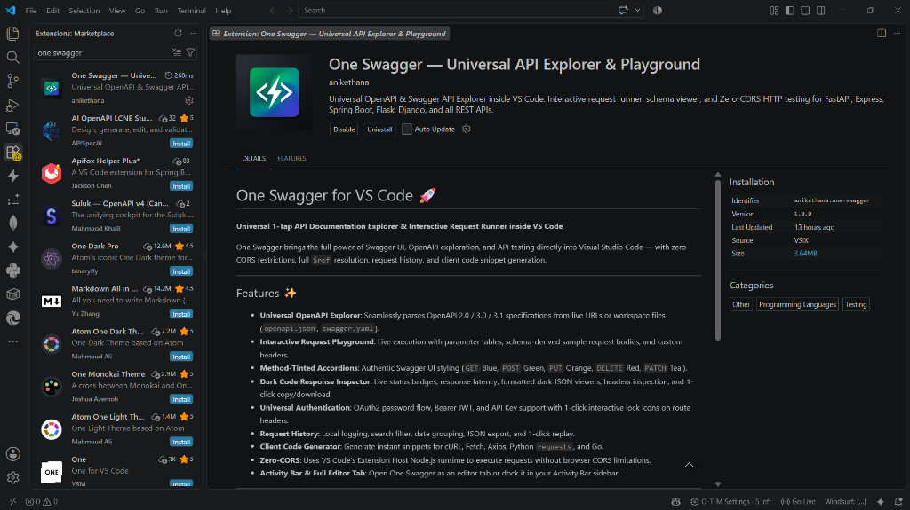

# One Swagger

**Universal 1-Tap API Documentation Explorer & Interactive Request Runner**

One Swagger is a lightweight API explorer web app, Chrome extension, and VS Code extension designed to load and interact with OpenAPI/Swagger specifications from any REST backend (FastAPI, Express, Spring Boot, Flask, Django, NestJS, ASP.NET, Go, etc.).

## VS Code Marketplace

**One Swagger is now live on the VS Code Marketplace!**



Install directly from VS Code: Extensions (Ctrl+Shift+X) -> Search "One Swagger" -> Click Install

Marketplace Link: https://marketplace.visualstudio.com/items?itemName=Anikethana.one-swagger

---

## Features

- **Universal OpenAPI Parser**: Parses OpenAPI 2.0 / 3.0 / 3.1 specifications with recursive `$ref` schema resolution.
- **Swagger UI Color Styling**: Authentic method-tinted cards (`GET` blue, `POST` green, `PUT` orange, `DELETE` red, `PATCH` teal).
- **Interactive Playground**: Parameter table, schema-derived sample request body generation, and wide execute button.
- **Dark Code Response Inspector**: Live response status badges, latency, dark JSON viewer, response headers, and 1-click copy/download.
- **Universal Authorization**: OAuth2 password flow, Bearer JWT, and API Key support with interactive 1-click lock icons on route headers.
- **Request History Drawer**: Logged in `localStorage` with date grouping, search filter, JSON export, and 1-click replay.
- **Client Code Generator**: Generate cURL, Fetch, Axios, Python `requests`, and Go code snippets.
- **Zero-CORS**: Background proxy service worker / Node.js extension host for seamless local and remote API testing.

## Tech Stack

- **Frontend**: React 19, TypeScript, Vite, Custom CSS
- **Backend**: Python 3.11+, FastAPI, Uvicorn, PyJWT
- **Chrome Extension**: Manifest V3
- **VS Code Extension**: Webview Panel, Activity Bar Sidebar, Custom Editor Provider

## Quick Start

### 1. Run Backend
```bash
cd backend
python -m venv .venv
source .venv/bin/activate  # Or .venv\Scripts\activate on Windows
pip install -r requirements.txt
python run.py
```

### 2. Run Frontend
```bash
cd frontend
npm install
npm run dev
```

Open `http://localhost:5173/` in your browser.

## Chrome Extension Setup

1. Build production bundle:
   ```bash
   cd frontend
   npm run build
   ```
2. Open Chrome and navigate to `chrome://extensions/`.
3. Enable **Developer mode** (top right).
4. Click **Load unpacked** and select `frontend/dist`.

## VS Code Extension Setup

Install from the marketplace or build locally:
```bash
cd vscode-extension
npm install
npm run build
npx @vscode/vsce package
code --install-extension one-swagger-1.0.0.vsix
```

## License

MIT
